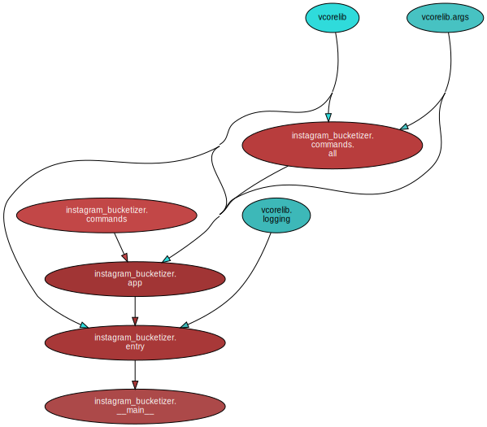

<!--
    =====================================
    generator=datazen
    version=3.1.4
    hash=16c7ea4391d0cfaab8bbebc36c6e297d
    =====================================
-->

# instagram-emoji-bucketizer ([0.1.0](https://pypi.org/project/instagram-emoji-bucketizer/))

[](https://pypi.org/project/instagram-emoji-bucketizer/)

[](https://codecov.io/github/dylanfromm/instagram-emoji-bucketizer)


*Short project description.*

## Documentation

### Generated

* By [sphinx-apidoc](https://dylanfromm.github.io/python/sphinx/instagram-emoji-bucketizer)
(What's [`sphinx-apidoc`](https://www.sphinx-doc.org/en/master/man/sphinx-apidoc.html)?)
* By [pydoc](https://dylanfromm.github.io/python/pydoc/instagram_emoji_bucketizer.html)
(What's [`pydoc`](https://docs.python.org/3/library/pydoc.html)?)

## Python Version Support

This package is tested with the following Python minor versions:

* [`python3.8`](https://docs.python.org/3.8/)
* [`python3.9`](https://docs.python.org/3.9/)
* [`python3.10`](https://docs.python.org/3.10/)
* [`python3.11`](https://docs.python.org/3.11/)

## Platform Support

This package is tested on the following platforms:

* `ubuntu-latest`
* `macos-latest`
* `windows-latest`

# Introduction

# Command-line Options

```
$ ./venv3.11/bin/instagram-emoji-bucketizer -h

usage: instagram-emoji-bucketizer [-h] [--version] [-v] [-q] [--curses]
                                  [--no-uvloop] [-C DIR]
                                  {noop} ...

Short project description.

options:
  -h, --help         show this help message and exit
  --version          show program's version number and exit
  -v, --verbose      set to increase logging verbosity
  -q, --quiet        set to reduce output
  --curses           whether or not to use curses.wrapper when starting
  --no-uvloop        whether or not to disable uvloop as event loop driver
  -C DIR, --dir DIR  execute from a specific directory

commands:
  {noop}             set of available commands
    noop             command stub (does nothing)

```

# Internal Dependency Graph

A coarse view of the internal structure and scale of
`instagram-emoji-bucketizer`'s source.
Generated using [pydeps](https://github.com/thebjorn/pydeps) (via
`mk python-deps`).


